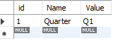

# 学生会内部管理系统设置

[英文版本 | English Version](./README.md)

**这是一个翻译版本。尽管已经努力确保其内容的准确性，如果有任何问题，您可能需要参考英文版本。**

# 学生会内部管理系统设置指南
欢迎使用学生会内部管理系统设置指南！

这份全面的指南旨在帮助学生会领导、管理员和IT专业人员搭建一个强大且用户友好的内部管理系统，以满足他们的特定需求。按照这里概述的步骤，您将能够简化行政流程，增强通信和协作，并赋予您的学生会蓬勃发展的力量。

那么，让我们开始搭建一个高效有效的学生会内部管理系统的旅程吧。

## 连接到云服务器
学生会内部管理系统运行在一个托管在云服务上的Linux（Ubuntu）服务器上，这消除了维护和硬件成本。云托管提供了一个可扩展和安全的环境，允许轻松访问并确保数据完整性。

有许多不同的服务提供云托管服务，因此在这里指定一个特定的服务是没有意义的。选择一个在您地区服务器较近且价格合理的服务。

您还需要购买一个指向服务器IP地址的域名。

> 💡 提示 - 这里有一些为服务器配置域名的通用指南。
> 1. 选择域名注册商：有许多域名注册商可供选择，如GoDaddy、Namecheap和Google Domains。选择一个符合您需求和预算的注册商。
> 2. 搜索可用域名：使用注册商的搜索工具找到您喜欢的可用域名。您可以通过关键词搜索域名，或输入特定的域名。
> 3. 购买域名：找到一个您喜欢的可用域名后，按照注册商的指示进行购买。您需要提供您的联系信息和支付细节。
> 4. 访问您的域名注册商的DNS设置：购买域名后，您需要访问域名注册商的DNS设置，将您的域名指向服务器的IP地址。具体步骤取决于您的注册商，但您应该能在他们的文档中找到指引。
> 5. 添加“A”记录：在您的DNS设置中，添加一个“A”记录，将您的域名指向服务器的IP地址。具体步骤取决于您的注册商，但通常您需要在“A”记录的“值”字段中输入服务器的IP地址。
> 6. 等待DNS传播：添加“A”记录后，更改在互联网上传播可能需要一些时间。这可能需要从几分钟到几小时不等。

一旦您购买了云服务器和域名，您将需要访问其终端以在其上托管系统。我推荐使用PuTTY SSH工具来实现这一点。

> 💡 提示 - 使用PuTTY通过SSH连接到云Linux服务器，请遵循以下简单指南：
> 1. 下载并安装PuTTY：访问PuTTY网站(https://www.putty.org/)，下载适用于您操作系统的PuTTY版本。按照屏幕上的指示安装PuTTY。
> 2. 获取服务器凭证：云服务应提供服务器的IP地址以及用户名和密码。
> 3. 启动PuTTY：从计算机的程序或应用菜单中打开PuTTY。
> 4. 配置连接：在PuTTY配置窗口中，在“主机名”字段中输入服务器IP地址。确保选择了“SSH”选项，并且端口设置为22（默认SSH端口）。
> 5. 保存会话：如果需要，您可以在“保存的会话”字段中输入会话名称，然后点击“保存”按钮，将这些设置保存以供将来使用。
> 6.

 连接到服务器：点击“打开”按钮开始SSH连接。
> 7. 提供登录凭证：一个新的终端窗口将打开。输入您的云服务提供商提供的用户名，然后按“回车”。如果您使用密码进行身份验证，请在提示时输入。如果您使用SSH密钥，请参考下一步。
> 8. 配置SSH密钥认证（如适用）：如果您使用SSH密钥而非密码，请遵循以下额外步骤：
   a. 在PuTTY配置窗口的左侧面板中点击“连接”。
   b. 展开“SSH”部分并选择“Auth”。
   c. 点击“浏览”按钮并在本地计算机上定位您的私钥文件。
   d. 点击“打开”返回到主配置窗口。
> 9. 完成登录过程：提供适当的凭证（密码或SSH密钥）后，按“回车”登录到云Linux服务器的SSH使用PuTTY。
> 连接后，您可以通过PuTTY终端窗口执行命令并在云Linux服务器上执行管理任务。

## 设置程序

使用以下命令下载安装脚本。
```console
curl -o setup.sh https://raw.githubusercontent.com/chungchunwang/Student-Union-System/main/app/scripts/setup.sh 
```
使用以下命令执行安装脚本。确保跟随屏幕上的指示操作。
```console
bash setup.sh
```
## 配置系统
### MySQL
首先，[安装MySQL Workbench](https://dev.mysql.com/downloads/workbench/)。连接到您的服务器。

> 💡 提示 - 这里是通过MySQL Workbench连接到MySQL服务器的步骤：
> 1. 打开MySQL Workbench。
> 2. 在主屏幕的“MySQL连接”部分点击“+”图标。
> 3. 在“连接名称”字段中输入连接的名称。
> 4. 在“主机名”字段中输入服务器的域名。
> 5. 点击“存储在保险库中”按钮安全存储root用户的密码。
> 6. 点击“测试连接”按钮测试到MySQL服务器的连接。如果连接成功，点击“确定”按钮保存连接。
> 7. 保存连接后，您可以在“MySQL连接”部分双击它来连接到MySQL服务器。

在[这里](../../app/sql/base.sql)下载Budibase的基础MySQL设置。

点击`Server->Data Import`，选择`Import from Self-Contained File`。在`Default Target Schema`旁边，选择`New`并输入您希望创建的模式（数据库）的名称。推荐的命名约定是按照此系统服务的特定学年来命名模式。因此，您可以为不同的年份拥有多个数据库副本。选择您下载的设置文件。要开始导入，点击页面底部的`Start`按钮。

导航到`Global_Variables`表，点击最右边的按钮查看其内容。注意有一行标题为`Quarter`。系统用它来确定学年的当前季度。其可能的值有`Q1`、`Q2`、`Q3`和`Q4`。确保根据需要更新此变量。



### Budibase
如果您在设置过程中提供的端口访问您的域名，您应该看到一个正在运行的空白Budibase实例。按照屏幕上的指示设置管理员帐户。我们不需要从头开始构建应用程序，我们只需要加载保存的应用文件。

#### 配置Budibase
转到仪表板。我们现在将配置全局Budibase设置。

##### 电子邮件
前往`电子邮件`，并配置SMTP设置，以便系统可以发送自动化电子邮件。您可能需要为此步骤创建一个免费的在线电子邮件，或者联系您的学校管理员获取另一个学校电子邮件。

下面您可以设置电子邮件模板。您可以使用默认模板。推荐的略微修改过的默认模板可以在[这里](../../app/email-templates/)找到。

##### 组织
前往`组织`，并输入您的学生会名称。同时上传其标志。将您的网站URL添加到`平台URL`中。如果需要的话，确保包括端口（例如 example.com:100）。保存您的更改。

##### 插件
前往`插件`，并点击添加插件。选择`URL`作为源，并添加以下url：
- https://github.com/chungchunwang/Budibase-File-Upload/releases/download/v1.1.8/Budibase-File-Upload-1.1.8.tar.gz
- https://github.com/chungchunwang/Budibase-File-Repeater/releases/download/v1.1.3/Budibase-File-Repeater-1.1.3.tar.gz
- https://github.com/andz-bb/budibase-component-accordion/releases/download/v1.2.0/accordion-1.2.0.tar.gz
- https://github.com/MartinPicc/budibase-interval-plugin/releases/download/v1.1.1/Interval-1.1.1.tar.gz
- https://github.com/rosnerdev/bb-qr-code/releases/download/v1.0.0/bb-qr-code-1.0.0.tar.gz
- https://github.com/aptkingston/budibase-comment-box/releases/download/v1.0.2/comment-box-1.0.2.tar.gz
- https://github.com/chungchunwang/Budibase-QR-Code-Scanner/releases/download/v1.0.2/QR-Code-Scanner-1.0.2.tar.gz

#### 安装应用
前往 https://github.com/chungchunwang/Student-Union-System/tree/main/app/budibase/exports 并下载应用的最新版本。在仪表板上，点击`创建新应用`，然后`导入应用`。在此，为应用命名然后导入文件。建议您将应用命名为数据库的相同名称。

登录后，更改MySQL的配置，将`主机`设置为您的域名，`密码`设置为您在设置过程中为MySQL设置的密码。将`数据库`设置为您的模式名称。保存您的配置。

#### 导入用户
在仪表板上，点击用户标签，导入您希望邀请到系统中的人员的电子邮件。您可以使用CSV文件。确保将普通用户设置为`应用用户`，不是`开发者`或`管理员`。

然后，点击您的应用上的`管理`，选择`访问`标签。将您导入的用户添加到您的应用中。您将需要指定他们的访问级别，包括`管理员`、`高级用户`和`基础用户`。有关每个类别的更多信息，请参阅学生会系统的用户文档。

如果您有很多用户，这可能相当繁琐，但您一年只需要做一次！不幸的是，更简单的方法是Budibase的收费功能。或者，您可以尝试使用Budibase API设置一个自动脚本来完成这个工作，尽管您需要自己弄清楚。

#### 配置应用
##### 分组
在Budibase应用的数据标签中的MySQL数据库的组部分。在这里，添加您学校中存在的所有不同组。您可以将其保存为csv并为连续年份上传。

#### 故障报告
前往设计标签，并查看故障报告页面。点击故障报告按钮组件，更改它触发的动作以转到您希望将系统的故障

报告报告到的特定页面。如果您认为这不必要，只需删除此页面。

#### Budibase漏洞的快速修复
由于某种原因，导入的手风琴插件不能正常工作。要解决这个问题，请在应用的设计标签中前往`/tasks/new/:group`，选择用户部分内的手风琴组件，并切换默认状态为关闭，然后再切换回开启。这似乎会“唤醒插件”。

## 多年管理系统
该应用旨在覆盖特定的学校年度。在多个学校年度，您将需要如上所述维护应用的新版本（尽管您不需要重新设置Budibase和MySQL，只需分别添加新应用和模式 - 因此，您不需要重新运行安装脚本）。出于档案目的，建议您保留过去学年的Budibase应用和MySQL模式，但将MySQL模式设置为只读。为此，请使用SQL命令：
```SQL
ALTER Schema `此处填写模式名称` READ ONLY = 1;
```

## 迁移服务器
如果有任何原因需要迁移服务器，您将需要将MySQL模式和Budibase应用迁移到新服务器。

首先，在新服务器上，运行上面的安装脚本以安装Budibase和MySQL。如果您还需要为新学年设置一个空白应用，请按照下面的步骤进行。

### 迁移MySQL模式
就像我们加载空白MySQL设置以安装空白应用一样，我们也可以将我们的模式保存为可以加载到新服务器上的文件。

在MySQL Workbench中，连接到您的原始MySQL服务器，并前往`服务器 -> 数据导出`。选择您希望迁移的模式，然后选择`导出到自包含文件`。在底部，勾选`包括创建模式`复选框。这意味着您无需像我们为上面的基础模式所做的那样重命名每个模式 - 它将在稍后导入时带有您设置的名称。点击`开始导出`以开始文件导出。

在新服务器上，前往`服务器 -> 数据导入`。选择`从自包含文件导入`，并选择您在上一步中生成的文件。然后，点击`开始导入`。

现在，您的MySQL模式应该已经移动到新服务器了。

### 迁移Budibase应用
迁移Budibase应用相当直接。对于您希望迁移的每个应用，点击`管理`，然后点击`...`按钮，然后`导出发布`。这应该会将代表应用的文件下载到您的设备上。在新的Budibase服务器上，点击`创建新应用`，然后`导入应用`。将您导出的文件拖到`导入文件`部分，并输入您的文件名。