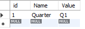

# Student Union Internal Management System Setup
Welcome to the guide for setting up the Student Union Internal Management System! 

This comprehensive guide aims to assist Student Union leaders, administrators, and IT professionals in hosting a robust and user-friendly Internal Management System tailored to their specific requirements. By following the steps outlined here, you'll be able to streamline administrative processes, enhance communication and collaboration, and empower your Student Union to thrive.

So, let's dive in and embark on the journey of setting up an efficient and effective Student Union Internal Management System.

## Connecting to a Cloud Server
The Student Union Internal Management System runs on a Linux (Ubuntu) server hosted on a cloud service, eliminating maintenance and hardware costs. Cloud hosting provides a scalable and secure environment, allowing easy access and ensuring data integrity.

There are a variety of different services that offer cloud hosting services, so it does not make sense to identify a particular one here. Choose one that has servers close to your region and is affordable.

You will also need to have purchased a domain that points to the IP address of your server. 

> 💡 Tip - Here are some general instructions for how to configure a domain for your server.
> 1. Choose a domain registrar: There are many domain registrars available, such as GoDaddy, Namecheap, and Google Domains. Choose one that suits your needs and budget.
> 2. Search for available domains: Use the registrar's search tool to find an available domain that you like. You can search for domains by keyword, or by entering a specific domain name.
> 3. Purchase the domain: Once you have found an available domain that you like, follow the registrar's instructions to purchase it. You will need to provide your contact information and payment details.
> 4. Access your domain registrar's DNS settings: Once you have purchased your domain, you will need to access your domain registrar's DNS settings to point your domain towards the IP address of your server. The exact steps for doing this will depend on your registrar, but you should be able to find instructions in their documentation.
> 5. Add an "A" record: In your DNS settings, add an "A" record that points your domain towards the IP address of your server. The exact steps for doing this will depend on your registrar, but you will typically need to enter the IP address of your server in the "Value" field of the "A" record.
> 6. Wait for DNS propagation: Once you have added the "A" record, it may take some time for the changes to propagate across the internet. This can take anywhere from a few minutes to a few hours.

Once you have purchased a cloud server and a domain, you will need to access its terminal to host the system on it. I recommend the PuTTY SSH tool to do this.

> 💡 Tip - To SSH into a cloud Linux server using PuTTY, follow these simple instructions:
> 1. Download and install PuTTY: Visit the PuTTY website (https://www.putty.org/) and download the appropriate version of PuTTY for your operating system. Install PuTTY by following the on-screen instructions.
> 2. Obtain server credentials: The cloud service should provide the IP address and the username and password for your server.
> 3. Launch PuTTY: Open PuTTY from your computer's programs or applications menu.
> 4. Configure the connection: In the PuTTY configuration window, enter the server IP address in the "Host Name" field. Make sure the "SSH" option is selected, and the port is set to 22 (the default SSH port).
> 5. Save the session: Optionally, you can enter a name for your session in the "Saved Sessions" field and click the "Save" button to save these settings for future use.
> 6. Connect to the server: Click the "Open" button to initiate the SSH connection.
> 7. Provide login credentials: A new terminal window will open. Enter the username provided by your cloud service provider and press "Enter." If you are using a password for authentication, enter it when prompted. If you are using an SSH key, refer to the next step.
> 8. Configure SSH key authentication (if applicable): If you are using an SSH key instead of a password, follow these additional steps:
   a. Click "Connection" in the left panel of the PuTTY configuration window.
   b. Expand the "SSH" section and select "Auth."
   c. Click the "Browse" button and locate your private key file on your local machine.
   d. Click "Open" to return to the main configuration window.
> 9. Complete the login process: After providing the appropriate credentials (either password or SSH key), press "Enter" to log in to the cloud Linux server via SSH using PuTTY.
> Once connected, you can execute commands and perform administrative tasks on the cloud Linux server through the PuTTY terminal window.

## Setting Up the Program

Download the setup script using the following line.
```console
curl -o setup.sh https://raw.githubusercontent.com/chungchunwang/Student-Union-System/main/app/scripts/setup.sh 
```
Execute the setup script using the following. Make sure to follow the on screen instructions.
```console
bash setup.sh
```
## Configuring the Systems
### MySQL
First, install MySQL Workbench at https://dev.mysql.com/downloads/workbench/. Connect to your server.

> 💡 Tip - Here are the steps to connect to a MySQL server via MySQL Workbench:
> 1. Open MySQL Workbench.
> 2. Click on the "+" icon in the "MySQL Connections" section of the home screen.
> 3. Enter a name for the connection in the "Connection Name" field.
> 4. Enter the domain of your sever in the "Hostname" field.
> 5. Click on the "Store in Vault" button to securely store the password for the root user.
> 6. Click on the "Test Connection" button to test the connection to the MySQL server. If the connection is successful, click on the "OK" button to save the connection.
> 7. Once you have saved the connection, you can double-click on it in the "MySQL Connections" section to connect to the MySQL server.

Download the base MySQL setup for Budibase [here](../../app/scripts/setup.sh).

Click `Server->Data Import`, and select `Import from Self-Contained File`. Next to `Default Target Schema`, select `New` and input the name of the schema (database) you wish to create. It is recommended convention that you name the schema after the particular school year this system is for. Thus, you can have multiple copies of the database for different years. Select the setup file you downloaded. To begin the import, click the `Start` button at the bottom of the page.

Navigate to the `Global_Variables` table, and click the rightmost button to view its contents. Notice that there is a row entitled `Quarter`. This is used by the system to determine the current quarter of the school year. Its possible values are `Q1`, `Q2`, `Q3`, and `Q4`. Make sure to update this variable as necessary.



### Budibase
If you access your domain at the port you provided during the setup process, you should see a running, blank Budibase instance. Follow the onscreen instructions to setup an admin account. Once you log in, it will make you generate a new Budibase app. Follow along until you are able to quit this tour. We will not need to build an app from scratch, we just have to load in the saved app file.

#### Install App
Go to https://github.com/chungchunwang/Student-Union-System/tree/main/app/budibase/exports and download the latest version of the app. On the dashboard, click `Create new app`, and then `Import app`. Here, give the app a name and then import the file. It is recommended that you give the app the same name as the database.

After you have logged in, change the configuration for MySQL to have `Host` be your domain name and `Password` be the password you set for MySQL during the setup process. Set `Database` to be the name of your schema. Save your configuration.

#### Configure Budibase
Exit the app and return to the dashboard. We will now configure the global Budibase settings.

##### Email
Go to `Email`, and configure the SMTP settings for an email address for the system to send automated emails with. You may have to create a free online email for this step, or contact your school administrator to obtain another school email.

Below you can set email templates. You can use the defaults there. Slightly modified versions of the defaults that are recommended can be found [here](../../app/email-templates/);

##### Organization
Go to `Organization`, and input the name of your student union. Also upload its logo. Add the URL of your site to `Platform URL`. Make sure to include the port if necessary (eg. example.com:100). Save your changes.

##### Plugins
Go to `Plugins`, and click add plugin. Choose `URL` as the source, and add the following urls:
- https://github.com/chungchunwang/Budibase-File-Upload/releases/download/v1.1.8/Budibase-File-Upload-1.1.8.tar.gz
- https://github.com/chungchunwang/Budibase-File-Repeater/releases/download/v1.1.3/Budibase-File-Repeater-1.1.3.tar.gz
- https://github.com/andz-bb/budibase-component-accordion/releases/download/v1.2.0/accordion-1.2.0.tar.gz
- https://github.com/MartinPicc/budibase-interval-plugin/releases/download/v1.1.1/Interval-1.1.1.tar.gz
- https://github.com/rosnerdev/bb-qr-code/releases/download/v1.0.0/bb-qr-code-1.0.0.tar.gz
- https://github.com/aptkingston/budibase-comment-box/releases/download/v1.0.2/comment-box-1.0.2.tar.gz
- https://github.com/chungchunwang/Budibase-QR-Code-Scanner/releases/download/v1.0.2/QR-Code-Scanner-1.0.2.tar.gz

#### Import Users
Click on the Users tab, and import the emails of the people you wish to invite to the system. You can make use of a CSV file. Make sure to set regular users as `App User`, not `Dev` or `Admin`.

Then, click `Manage` on your app, and select the `Access` tab. Add the users you imported into you app. You will have to specify their level of access between either `Admin`, `Power`, and `Basic`. Consult the user documentation for the Student Union System for more information about what each of these categories entails.

This can be rather tedious if you have a lot of users, however you will only have to do it once a year! Unfortunately an easier method has been paywalled by Budibase.

## Managing the System Over Many Years
The app is designed to work over a particular school year. Over multiple school years, it is recommended that you maintain the Budibase app and MySQL schema for past school years, but set the MySQL schema to read only. This can be done as outlined [here](https://stackoverflow.com/a/18401612).

To create a new app for a school year, follow the steps given above to create an new schema and app for the year. Note that you do not need to rerun the installation script - you can have multiple schemas in MySQL and multiple apps in Budibase.